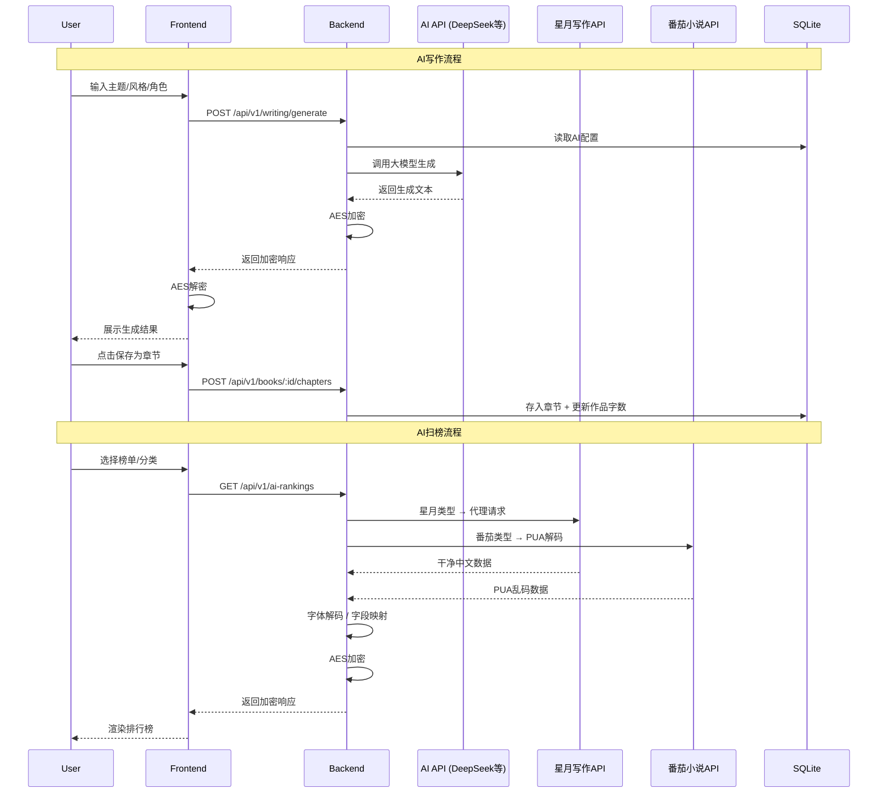

# AI写作工作台 + 扫榜系统 · 完整开发文档

> 最后更新：2026-05-17

## 一、项目概述

### 1.1 项目目标

复刻星月写作（xingyuexiezuo.com）的核心功能，构建本地化全栈 AI 写作工作台 + 扫榜系统。

### 1.2 核心功能清单

#### AI写作模块
| 功能 | 说明 |
|------|------|
| AI生成 | 根据主题/风格/角色/大纲生成小说正文 |
| AI续写 | 根据前文无缝续写 |
| AI扩写/润色/缩写 | 对已有文本进行处理 |
| 12种写作风格 | 仙侠/都市/科幻/玄幻/历史/悬疑/游戏/轻小说/言情/末日/武侠/脑洞 |
| 🆕 写作风格预设 | 三态切换：快捷选项 / 自定义输入 / 更多预设面板 |
| 🆕 写作要求预设 | 三态切换：快捷选项 / 自定义输入 / 更多预设面板 |
| 🆕 自定义预设管理 | 自由输入Prompt并保存为预设，localStorage持久化，支持删除 |
| 🆕 从文本提取风格 | AI分析参考文本的写作风格特征，一键应用 |
| 提示词关联 | 写作时从提示词库快速选用并自动注入 |
| 分步剧情指令 | 独立的分步剧情输入框 |

#### AI创意工具箱（17个生成器，2026-05-17全线升级）

| 生成器 | 功能 | 升级亮点 |
|--------|------|----------|
| book_title | 书名生成器 | +市场关键词/风格标签/市场吸引力 |
| synopsis | 简介生成器 | 多版本输出（悬念/卖点/情感版） |
| outline | 大纲生成器 | **五层规划**：宏观→卷→节奏板→章节列表→细化 |
| detailed_outline | 细纲生成器 | **InkOS 7段式** + AI完善/拆分工作台 + Hook账本 |
| opening | 黄金开篇生成器 | 正文+结构化分析（钩子类型/分幕/出场方式） |
| golden_finger | 金手指设计器 | +使用限制/隐藏能力/升级路径/天敌弱点 |
| name_generator | 角色取名生成器 | +发音/角色类型暗示 |
| character_design | 人设生成器 | +内心冲突/核心动机/致命缺陷/人际关系/口头禅 |
| world | 世界观生成器 | JSON结构化（力量体系+势力+地理+独特法则+隐藏秘密） |
| imagination | 脑洞生成器 | +一句话卖点/冲突引擎/反转潜力/市场适配 |
| title_rewrite | 标题仿写 | +风格分析/仿写手法/结构相似度 |
| summary_rewrite | 简介仿写 | 多版本输出（悬念/卖点/情感/反转版） |
| imagination_rewrite | 脑洞仿写 | +创意模式提取/差异化/可扩展性 |
| book_analysis | 书籍分析器 | +优势/不足/同类书对比/章节逐段评审/风险评级 |
| chapter_title | 章节起名 | +情感调性/关键词/备选标题 |
| cover_prompt | 封面提示词 | JSON结构化（中英双版/色彩方案/构图/MJ+SD参数） |
| volume_summary | 分卷概要 | +核心承诺/升级模式/卷末高潮/伏笔/章节分配 |

**🆕 细纲 AI 工作台**（对标 51mazi + InkOS）：
- **完善模式**：5种方向 — 整体扩写/补充细节/强化冲突/优化节奏/补足世界观
- **拆分模式**：4种方式 — 按剧情推进/按冲突升级/按时间顺序/按章节策划，拆分数量 2-12
- 生成结果对比预览 + 应用/保存/丢弃

**🆕 大纲五层规划查看器**（对标 AI-Novel-Writing-Assistant）：
- 故事宏观卡片（logline+核心卖点+主题+目标读者）
- 卷选择器 + 卷详情
- 节奏板（标签订阅+章节跨度+必须交付项）
- 章节列表（标题+概要+冲突，按Beat分组）

#### 写作辅助
| 功能 | 说明 |
|------|------|
| 作品管理 | 多作品创建/切换 |
| 章节持久化 | 自动保存AI生成内容为章节 |
| 角色卡 | 角色人设管理，写作时多选关联 |
| 词条卡 | 风格/要求/指令三种类型组合 |
| 每日统计 | 调用次数和字数统计 |
| 提示词库 | CRUD + 分类/收藏/公开分享 |
| AI模型配置 | 多模型切换/测试连接 |

#### AI扫榜
| 功能 | 说明 |
|------|------|
| AI排行榜 | 按平台/分类筛选，支持8种榜单类型 |
| 分类统计 | 各榜单分类数量统计 |
| 热词提取 | 高亮热词云 |
| 创作灵感 | 基于榜单AI生成灵感 |
| 搜索 | 关键词搜索榜单 |
| 热门新闻 | 抖音/微博/头条/百度/B站多源聚合 |
| 小说细纲 | URL抓取 + AI分析（简述/事件/角色/冲突/钩子） |
| 粘贴分析 | 粘贴章节文本AI分析 |

#### 系统
| 功能 | 说明 |
|------|------|
| AES加密 | 全链路 API 响应加密 |
| PUA字体解码 | 番茄小说乱码解码（~306条映射，~95%可读率） |
| 双API数据源 | 星月写作API（干净文本）+ 番茄小说API（需PUA解码） |

### 1.3 技术栈

#### 后端
| 技术 | 版本 | 用途 |
|------|------|------|
| Node.js | v22 | 运行环境 |
| Express | ^4.21 | HTTP服务 |
| better-sqlite3 | ^11 | SQLite数据库 |
| node-cron | ^3 | 定时任务 |
| cors | ^2 | 跨域 |
| Playwright | - | 网页爬取 |
| opentype.js | - | PUA字体解码 |

#### 前端
| 技术 | 版本 | 用途 |
|------|------|------|
| Vue3 | ^3.5 | 前端框架（Composition API） |
| Vant | ^4 | 移动端UI组件库 |
| Vue Router | ^4 | 路由 |
| Pinia | ^2 | 状态管理 |
| Axios | ^1 | HTTP请求 |
| Vite | ^6 | 构建工具 |
| CryptoJS | ^4 | AES解密 |
| marked | - | Markdown渲染 |
| localStorage | - | 自定义预设持久化 |

#### 数据加密
| 属性 | 值 |
|------|-----|
| 算法 | AES-128-CBC |
| 密钥 | `chloefuckityoall`（16字节） |
| IV | `9311019310287172`（16字节） |
| 填充 | PKCS7 |
| 编码 | Base64 |


## 二、项目结构

```
ai-rankings-project/
├── 开发文档.md
├── 提示词.md
├── CLAUDE.md
├── start.bat                    # 一键启动
├── backend/
│   ├── package.json
│   ├── xingyue_config.json      # 星月API Token
│   ├── pua_mapping.json         # PUA字体映射
│   ├── scrape_xingyue_prompts.py
│   └── src/
│       ├── index.js             # 入口（端口3001）
│       ├── config/index.js      # 配置
│       ├── middleware/
│       │   └── encrypt.js       # AES加密中间件
│       ├── routes/              # 15个路由文件
│       │   ├── index.js
│       │   ├── aiConfig.js      # AI模型配置
│       │   ├── aiRankings.js    # AI排行榜
│       │   ├── bookProject.js   # 书籍项目 + 章节
│       │   ├── categories.js    # 分类标签
│       │   ├── characters.js    # 角色卡
│       │   ├── creativeTools.js # AI创意工具
│       │   ├── fanqieLibrary.js # 番茄书库
│       │   ├── hotNews.js       # 热门新闻
│       │   ├── novelOutline.js  # 小说细纲
│       │   ├── prompts.js       # 提示词
│       │   ├── wordCards.js     # 词条卡
│       │   ├── writing.js       # AI写作
│       │   └── xingyue.js       # 星月写作代理
│       ├── controllers/         # 15个控制器
│       ├── services/            # 23个服务
│       │   ├── aiService.js     # AI章节分析
│       │   ├── creativeToolService.js  # 17个创意生成器
│       │   ├── writingService.js       # AI写作引擎 + 风格提取
│       │   ├── promptService.js        # 提示词CRUD + 种子数据 + 续写要求加载
│       │   ├── labelService.js         # 🆕 标签系统 + style-presets查询
│       │   ├── wordCardService.js      # 词条卡CRUD+种子
│       │   ├── characterService.js     # 角色卡CRUD
│       │   ├── aiConfigService.js      # AI配置
│       │   ├── bookProjectService.js   # 作品CRUD
│       │   ├── chapterService.js       # 章节CRUD
│       │   ├── contextService.js       # 🆕 上下文组装（角色/大纲/关联章节）
│       │   ├── novelOutlineService.js  # 大纲爬取
│       │   ├── novelReviewService.js   # 🆕 AI审稿服务
│       │   ├── auditService.js         # 🆕 AI纠错/审稿
│       │   ├── repairService.js        # 🆕 AI修复
│       │   ├── rankService.js          # 排行榜
│       │   ├── xingyueService.js       # 星月API代理
│       │   ├── fanqieLibraryService.js # 番茄API代理
│       │   ├── fontDecoder.js          # PUA字体解码
│       │   ├── hotNewsService.js
│       │   └── inspirationService.js
│       ├── models/
│       │   ├── database.js      # SQLite + schema + 自动迁移
│       │   └── seed.js          # 种子数据
│       └── utils/crypto.js      # AES工具
├── frontend/
│   ├── package.json
│   ├── vite.config.js
│   └── src/
│       ├── main.js
│       ├── App.vue
│       ├── router/index.js
│       ├── stores/app.js
│       ├── api/                 # 13个API模块
│       │   ├── request.js       # Axios + 解密
│       │   ├── writing.js
│       │   ├── prompts.js
│       │   ├── creativeTools.js
│       │   ├── characters.js
│       │   ├── wordCards.js
│       │   ├── aiSettings.js
│       │   ├── aiRankings.js
│       │   ├── books.js
│       │   ├── categories.js
│       │   ├── fanqieLibrary.js
│       │   ├── hotNews.js
│       │   ├── novelOutline.js
│       │   └── xingyueRankings.js
│       ├── views/               # 12个页面
│       │   ├── Writing.vue      # AI写作工作台（首页）
│       │   ├── CreativeToolbox.vue  # 🆕 创意工具箱（17生成器全线升级，含AI工作台）
│       │   ├── PromptLibrary.vue    # 提示词库
│       │   ├── CharacterCards.vue   # 角色卡
│       │   ├── AISettings.vue       # AI模型配置
│       │   ├── Rankings.vue         # AI扫榜
│       │   ├── Home.vue             # 首页/实时数据
│       │   ├── HotNews.vue          # 热门新闻
│       │   ├── NovelOutline.vue     # 小说细纲
│       │   ├── BookDetail.vue       # 书籍详情
│       │   ├── Tutorial.vue         # 教程
│       │   └── Search.vue           # 搜索
│       ├── composables/writing/  # 16个写作模块（Vue3 Composition API）
│       │   ├── useInit.js         # 预设数据加载 + 默认回退 + Prompt拼接
│       │   ├── useAiForm.js       # AI表单状态（模型/风格/模式）
│       │   ├── useAiConfig.js     # AI功能配置（10种工具 + 变体）
│       │   ├── useAiExecution.js  # AI执行：组装系统提示词 + 调用
│       │   ├── useCustomPresets.js # 🆕 自定义预设CRUD + localStorage持久化
│       │   ├── useEditor.js       # 编辑器核心状态
│       │   ├── useExtractStyle.js # 从文本提取写作风格
│       │   ├── useBookManagement.js    # 作品管理
│       │   ├── useChapterManagement.js # 章节管理
│       │   ├── useChapterSummary.js    # 章节概要
│       │   ├── useCharacterPicker.js   # 角色选择器
│       │   ├── usePromptPicker.js      # 提示词选择器
│       │   ├── useCorrectionRules.js   # 纠错规则
│       │   ├── useDiffPreview.js       # 差异预览
│       │   ├── useContextAwareness.js  # 上下文感知
│       │   └── useKeywordReplace.js    # 关键词批量替换
│       ├── components/          # TabBar/BookCard/HotWordCloud +
│       │   │                    # 🆕 OutlineViewer / DetailedOutlineEditor /
│       │   │                    #    AIWorkbenchDialog / HookLedgerPanel
│       └── utils/               # crypto.js / usageStats.js
└── database/
    └── schema.sql
```


## 三、数据库设计

### 3.1 表结构总览（16张表）

| 表名 | 功能 |
|------|------|
| rank_type | 排行类型（8种） |
| book | 书籍排行数据（含ai_analysis等字段） |
| ai_category | 小说分类 |
| subcategory_stat | 子分类统计 |
| hot_word | 热词 |
| inspiration | 灵感 |
| news_source | 新闻来源 |
| hot_news | 热点新闻 |
| novel_outline_job | 大纲抓取任务 |
| novel_chapter_outline | 章节细纲 |
| ai_config | AI模型配置 |
| ai_prompt | **提示词库** |
| book_project | **写作作品** |
| book_chapter | **章节** |
| word_card | **词条卡** |
| character_card | **角色卡** |
| font_cache | 字体PUA映射 |

### 3.2 核心写作表

#### ai_prompt（提示词）
```sql
CREATE TABLE ai_prompt (
    id INTEGER PRIMARY KEY AUTOINCREMENT,
    title TEXT NOT NULL,
    content TEXT NOT NULL,
    category TEXT DEFAULT '通用',
    tags TEXT DEFAULT '[]',
    author TEXT DEFAULT '',
    usage_count INTEGER DEFAULT 0,
    favorite_count INTEGER DEFAULT 0,
    is_public INTEGER DEFAULT 1,
    created_at DATETIME DEFAULT CURRENT_TIMESTAMP,
    updated_at DATETIME DEFAULT CURRENT_TIMESTAMP
);
```

#### book_project（作品）
```sql
CREATE TABLE book_project (
    id INTEGER PRIMARY KEY AUTOINCREMENT,
    title TEXT NOT NULL,
    description TEXT DEFAULT '',
    cover_url TEXT DEFAULT '',
    style TEXT DEFAULT '',
    status TEXT DEFAULT 'draft',
    total_words INTEGER DEFAULT 0,
    created_at DATETIME DEFAULT CURRENT_TIMESTAMP,
    updated_at DATETIME DEFAULT CURRENT_TIMESTAMP
);
```

#### book_chapter（章节）
```sql
CREATE TABLE book_chapter (
    id INTEGER PRIMARY KEY AUTOINCREMENT,
    project_id INTEGER NOT NULL,
    chapter_index INTEGER NOT NULL,
    title TEXT DEFAULT '',
    content TEXT DEFAULT '',
    word_count INTEGER DEFAULT 0,
    ai_model TEXT DEFAULT '',
    created_at DATETIME DEFAULT CURRENT_TIMESTAMP,
    updated_at DATETIME DEFAULT CURRENT_TIMESTAMP,
    FOREIGN KEY (project_id) REFERENCES book_project(id) ON DELETE CASCADE
);
```

#### word_card（词条卡）
```sql
CREATE TABLE word_card (
    id INTEGER PRIMARY KEY AUTOINCREMENT,
    name TEXT NOT NULL,
    content TEXT NOT NULL,
    card_type TEXT DEFAULT 'style',    -- style/requirement/instruction
    is_public INTEGER DEFAULT 0,
    author TEXT DEFAULT '',
    usage_count INTEGER DEFAULT 0,
    created_at DATETIME DEFAULT CURRENT_TIMESTAMP
);
```

#### ai_label（提示词标签，多对多）
```sql
CREATE TABLE ai_label (
    id INTEGER PRIMARY KEY AUTOINCREMENT,
    name TEXT NOT NULL,
    parent_id INTEGER DEFAULT 0,
    sort_order INTEGER DEFAULT 0,
    created_at DATETIME DEFAULT CURRENT_TIMESTAMP,
    updated_at DATETIME DEFAULT CURRENT_TIMESTAMP
);

CREATE TABLE ai_prompt_label (
    prompt_id INTEGER NOT NULL,
    label_id INTEGER NOT NULL,
    PRIMARY KEY (prompt_id, label_id),
    FOREIGN KEY (prompt_id) REFERENCES ai_prompt(id) ON DELETE CASCADE,
    FOREIGN KEY (label_id) REFERENCES ai_label(id) ON DELETE CASCADE
);
```

#### character_card（角色卡）
```sql
CREATE TABLE character_card (
    id INTEGER PRIMARY KEY AUTOINCREMENT,
    name TEXT NOT NULL,
    gender TEXT DEFAULT '',
    age TEXT DEFAULT '',
    personality TEXT DEFAULT '',
    background TEXT DEFAULT '',
    abilities TEXT DEFAULT '',
    appearance TEXT DEFAULT '',
    notes TEXT DEFAULT '',
    novel_id INTEGER DEFAULT 0,
    created_at DATETIME DEFAULT CURRENT_TIMESTAMP
);
```


### 3.3 写作风格/要求自定义预设系统（🆕 2026-05-16）

#### 架构概览

```
Writing.vue (UI层)
  ├── segmented 三态按钮 (preset / custom / more)
  ├── 弹窗组件 (保存预设 / 提取风格)
  │
  ├── useCustomPresets.js  ── localStorage CRUD
  │   ├── customStylePresets       [{title, content, createdAt, isCustom}]
  │   └── customRequirementPresets [{title, content, createdAt, isCustom}]
  │
  ├── useInit.js ── 预设数据聚合层
  │   ├── stylePresets / requirementPresets  ← API fetch (ai_prompt表)
  │   ├── customStylePresets / customRequirementPresets  ← localStorage
  │   ├── allStylePresets / allRequirementPresets  ← 合并上方两者 (computed)
  │   └── getStylePromptSection / getRequirementPromptSection  ← 自定义/预设双模式
  │
  └── useAiExecution.js ── Prompt组装
      └── getSystemPromptContent()
          ├── mode === 'custom' → 直接用 aiForm.customStylePrompt
          └── mode === 'preset' → 查找预设内容
```

#### 三态切换逻辑

| 模式 | aiForm 字段 | UI 渲染 | 数据来源 | Prompt拼接 |
|------|------------|---------|---------|-----------|
| `preset` | `styleMode='preset'` | `<select>` 下拉框 | `ai_prompt` 表 (API) | `getPresetPromptSection()` 查找 |
| `custom` | `styleMode='custom'` | `<textarea>` 自由输入 | `aiForm.customStylePrompt` | 直接拼接：`## 写作风格（自定义）\n{文本}` |
| `more` | `styleMode='more'` | 卡片面板 (内置+自定义) | `allStylePresets` computed | 点击卡片选中后切回 `preset` 模式 |

#### localStorage 持久化方案

```js
// Key: custom_style_presets_v1
// Value: [{"title":"我的古风写法","content":"多用短句...","createdAt":1715846400000}]

// Key: custom_requirement_presets_v1  
// Value: [{"title":"高冲突续写","content":"每段推进矛盾...","createdAt":1715846400000}]
```

**持久化流程**：`useCustomPresets.js` 提供 `save/delete/update/loadAll` 方法，写入后立即 `JSON.stringify` 存入 localStorage。页面 `init()` 时调用 `loadCustomPresetsData()` 恢复。

#### 关键文件

| 文件 | 行数 | 职责 |
|------|------|------|
| `composables/writing/useAiForm.js` | ~74 | `aiForm` 新增 4 字段：`styleMode`、`customStylePrompt`、`requirementMode`、`customRequirementPrompt` |
| `composables/writing/useCustomPresets.js` | ~85 | 🆕 新建文件，localStorage CRUD 封装 |
| `composables/writing/useInit.js` | ~130 | 新增 `allStylePresets`/`allRequirementPresets` computed，新增 `getStylePromptSection`/`getRequirementPromptSection` |
| `composables/writing/useAiExecution.js` | ~144 | `getSystemPromptContent()` 适配自定义/预设双模式 |
| `views/Writing.vue` | ~4350 | 模板重构（三态条件渲染）、保存弹窗、更多面板、新增 CSS |

#### 预设数据流

```
                    ┌──────────────────┐
                    │   ai_prompt 表     │  ← 后端 SQLite
                    │ (category分类)     │
                    └────────┬─────────┘
                             │ GET /prompts/style-presets
                             ▼
                    ┌──────────────────┐
                    │  stylePresets[]   │  ← 内置预设 (API动态)
                    │  requirementPresets[] │
                    └────────┬─────────┘
                             │
              ┌──────────────┼──────────────┐
              │              │              │
              ▼              ▼              ▼
        快捷选项         自定义输入       更多面板
        (select)       (textarea)     (卡片列表)
              │              │              │
              │              ▼              │
              │     ┌──────────────┐        │
              │     │ localStorage  │        │
              │     │ custom_*_v1   │        │
              │     └──────┬───────┘        │
              │            │                │
              ▼            ▼                ▼
         ┌────────────────────────────────────┐
         │    getSystemPromptContent()         │
         │    组装最终 AI 系统提示词             │
         └────────────────────────────────────┘
```


## 四、API接口设计

### 4.1 统一返回格式
```json
{
    "code": 200,
    "status": "Success",
    "message": "Success",
    "data": { "encoded": "<AES加密Base64>" }
}
```

### 4.2 AI写作接口

| 方法 | 路径 | 功能 |
|------|------|------|
| GET | `/api/v1/writing/styles` | 获取12种写作风格列表 |
| POST | `/api/v1/writing/generate` | AI生成正文 |
| POST | `/api/v1/writing/continue` | AI续写 |
| POST | `/api/v1/writing/expand` | AI扩写/润色/缩写 |
| POST | `/api/v1/writing/extract-style` | 🆕 从文本提取写作风格（LLM分析→JSON） |

**生成请求示例：**
```json
{
    "theme": "都市修仙",
    "style": "玄幻",
    "word_count": 800,
    "characters": [{ "name": "林风", "gender": "男", "personality": "坚韧" }],
    "outline": "（可选）故事大纲..."
}
```

### 4.3 AI创意工具接口

| 方法 | 路径 | 功能 |
|------|------|------|
| GET | `/api/v1/creative-tools` | 获取17个生成器列表 |
| POST | `/api/v1/creative-tools/generate` | 执行生成 |
| POST | `/api/v1/creative-tools/refine` | 🆕 AI完善大纲/细纲节点 |
| POST | `/api/v1/creative-tools/split` | 🆕 AI拆分大纲/细纲节点 |

**生成请求：**
```json
{ "tool_key": "imagination", "theme": "系统流反套路", "count": 5 }
```

**完善请求：**
```json
{
  "tool_key": "detailed_outline",
  "original_data": { /* 原始JSON节点 */ },
  "mode": "refine",
  "direction": "conflict",
  "extra_instruction": "强调主角内心挣扎"
}
```

**拆分请求：**
```json
{
  "tool_key": "detailed_outline",
  "original_data": { /* 原始JSON节点 */ },
  "mode": "split",
  "direction": "chapter",
  "split_count": 4,
  "extra_instruction": "每章要有独立高潮"
}
```

**完善方向（direction）：** `overall`（整体扩写）/ `details`（补充细节）/ `conflict`（强化冲突）/ `pacing`（优化节奏）/ `world`（补足世界观）

**拆分方式（direction）：** `plot`（按剧情推进）/ `conflict`（按冲突升级）/ `timeline`（按时间顺序）/ `chapter`（按章节策划）

**支持的 tool_key：**
`book_title`, `synopsis`, `outline`, `detailed_outline`, `opening`, `golden_finger`, `name_generator`, `character_design`, `world`, `imagination`, `title_rewrite`, `summary_rewrite`, `imagination_rewrite`, `book_analysis`, `chapter_title`, `cover_prompt`, `volume_summary`

### 4.3.1 创意工具箱前端组件（🆕 2026-05-17）

**架构**：`CreativeToolbox.vue` 通过 `tool_key` → 渲染器组件的映射实现动态渲染，复杂生成器使用专属组件，简单生成器使用内联模板。

```
CreativeToolbox.vue (主页面)
  ├── 工具选择网格 (17卡片)
  ├── 参数表单 (动态 inputs + 附加指令)
  ├── 渲染器映射
  │   ├── outline        → OutlineViewer.vue       (五层大纲钻取)
  │   ├── detailed_outline → DetailedOutlineEditor.vue (7段式编辑器)
  │   ├── character_design → 内联 van-collapse       (分栏卡片)
  │   ├── world          → 内联 van-tabs             (分类展示)
  │   ├── golden_finger  → 内联 van-steps            (升级路径)
  │   └── 其他            → 内联 result-card         (通用JSON渲染)
  └── AIWorkbenchDialog.vue (完善/拆分弹窗)
```

**新增组件**：

| 组件 | 文件 | 说明 |
|------|------|------|
| OutlineViewer | `components/OutlineViewer.vue` | 五层大纲钻取式查看器（宏观→卷→节奏板→章节→细化） |
| DetailedOutlineEditor | `components/DetailedOutlineEditor.vue` | 7段式细纲编辑器（任务/期待/兑现/过渡/抉择/改变/Hook账本） |
| AIWorkbenchDialog | `components/AIWorkbenchDialog.vue` | AI工作台弹窗（完善5模式+拆分4方式+结果预览+应用） |

**生成器输出结构升级对照**（仅列主要变更）：

| 生成器 | 原输出 | 新输出 |
|--------|--------|--------|
| outline | Markdown 文本 | JSON五层嵌套 + Markdown双输出 |
| detailed_outline | 5字段扁平JSON | 7段式嵌套JSON（seven_part子对象） |
| opening | 纯文本 | JSON { content, analysis: { hook_type, structure[], ... } } |
| world | Markdown 文本 | JSON { basic_info, power_system, factions[], ... } |
| cover_prompt | 纯文本 | JSON { cn_prompt, en_prompt, style_keywords[], ... } |
| synopsis | 纯文本 | JSON [{ version_type, content, strategy }] |
| summary_rewrite | 纯文本 | JSON [{ version_type, content, approach }] |
| golden_finger | 5字段 | 10字段（+limitations/hidden_abilities/upgrade_path/weakness/conflict_source） |
| character_design | 8字段 | 14字段（+inner_conflict/relationships/motivation/fatal_flaw/quirks/speech_style） |
| book_analysis | 7字段 | 12字段（+strengths/weaknesses/risk_rating/comparison_books/chapter_review） |

**AI细纲工作台交互流程**：
```
[DetailedOutlineEditor] 展开章节 → 点击"完善"或"拆分"
  → [CreativeToolbox] openWorkbench(mode, target)
  → [AIWorkbenchDialog] 底部弹出
    → 选择方向 + 附加指令
    → 点击"开始完善/拆分" → 调用 /refine 或 /split API
    → 结果预览
    → 点击"应用结果" → emit('confirm') → handleWorkbenchConfirm()
      → 替换 output → 页面展示新结果
```

### 4.4 提示词接口

| 方法 | 路径 | 功能 |
|------|------|------|
| GET | `/api/v1/prompts/categories` | 获取分类列表 |
| GET | `/api/v1/prompts/style-presets` | 🆕 获取写作风格/要求预设（从 ai_prompt 按写作分类查询） |
| GET | `/api/v1/prompts?category=&keyword=&label_id=&limit=50` | 列表 |
| GET | `/api/v1/prompts/:id` | 详情（自动+1 usage_count） |
| POST | `/api/v1/prompts` | 创建 |
| PUT | `/api/v1/prompts/:id` | 更新 |
| DELETE | `/api/v1/prompts/:id` | 删除 |
| POST | `/api/v1/prompts/:id/favorite` | 收藏 |

### 4.5 角色卡接口

| 方法 | 路径 | 功能 |
|------|------|------|
| GET | `/api/v1/characters?keyword=` | 列表 |
| GET | `/api/v1/characters/:id` | 详情 |
| POST | `/api/v1/characters` | 创建 |
| PUT | `/api/v1/characters/:id` | 更新 |
| DELETE | `/api/v1/characters/:id` | 删除 |

### 4.6 词条卡接口

| 方法 | 路径 | 功能 |
|------|------|------|
| GET | `/api/v1/word-cards/types` | 获取类型枚举 |
| GET | `/api/v1/word-cards?type=` | 列表 |
| POST | `/api/v1/word-cards` | 创建 |
| PUT | `/api/v1/word-cards/:id` | 更新 |
| DELETE | `/api/v1/word-cards/:id` | 删除 |

### 4.7 AI配置接口

| 方法 | 路径 | 功能 |
|------|------|------|
| GET | `/api/v1/ai-config` | 获取当前配置 |
| PUT | `/api/v1/ai-config` | 更新配置 |
| POST | `/api/v1/ai-config/test` | 测试连接 |
| GET | `/api/v1/ai-config/models` | 模型列表 |
| POST | `/api/v1/ai-config/switch-model` | 切换模型 |

### 4.8 作品/章节接口

| 方法 | 路径 | 功能 |
|------|------|------|
| GET | `/api/v1/books` | 作品列表 |
| POST | `/api/v1/books` | 创建作品 |
| GET/PUT/DELETE | `/api/v1/books/:id` | 作品CRUD |
| GET | `/api/v1/books/:pid/chapters` | 章节列表 |
| POST | `/api/v1/books/:pid/chapters` | 创建章节 |
| GET/PUT/DELETE | `/api/v1/books/:pid/chapters/:id` | 章节CRUD |

### 4.9 AI扫榜接口

| 方法 | 路径 | 功能 |
|------|------|------|
| GET | `/api/v1/ai-rankings?rank_type=&subcategory=&limit=` | 排行 |
| GET | `/api/v1/ai-rankings/categories?rank_type=` | 分类 |
| GET | `/api/v1/ai-rankings/hot-words?rank_type=&subcategory=` | 热词 |
| GET | `/api/v1/ai-rankings/inspiration?rank_type=&subcategory=` | 灵感 |
| GET | `/api/v1/ai-rankings/total?rank_type=&page=&per_page=` | 分页 |
| GET | `/api/v1/ai-rankings/category-totals?rank_type=` | 分类统计 |
| GET | `/api/v1/ai-rankings/total/search?keyword=` | 搜索 |
| GET | `/api/v1/ai-rankings/books-by-ids?ids=` | 按ID查书 |

### 4.10 其他接口

| 方法 | 路径 | 功能 |
|------|------|------|
| GET | `/api/v1/ping` | 健康检查 |
| GET | `/api/v1/categories` | 小说分类 |
| GET | `/api/v1/tags` | 标签 |
| GET | `/api/v1/labels` | 🆕 标签树（ai_label 递归查询） |
| GET | `/api/v1/labels/flat` | 🆕 扁平标签列表 |
| GET | `/api/v1/hot-news/sources` | 新闻来源 |
| GET | `/api/v1/hot-news?source=&date=` | 新闻列表 |
| POST | `/api/v1/novel-outline/crawl` | URL抓取大纲 |
| POST | `/api/v1/novel-outline/analyze` | 粘贴分析 |
| GET | `/api/v1/xingyue/live` | 星月实时数据 |
| GET | `/api/v1/xingyue/rankings` | 星月排行 |


## 五、前端路由

| 路由 | 页面 | 功能 |
|------|------|------|
| `/` → `/writing` | Writing.vue | **AI写作工作台**（默认首页） |
| `/writing` | Writing.vue | 生成/续写/扩写 + 提示词联动 |
| `/creative` | CreativeToolbox.vue | 17个AI创意生成器 |
| `/prompts` | PromptLibrary.vue | 提示词库（分类/收藏/创建） |
| `/characters` | CharacterCards.vue | 角色卡管理 |
| `/ai-settings` | AISettings.vue | AI模型配置/测试 |
| `/tutorial` | Tutorial.vue | 教程 |
| `/book/:id` | BookDetail.vue | 书籍详情+AI分析 |
| `/rankings` | Rankings.vue | AI扫榜 |
| `/hot-news` | HotNews.vue | 热门新闻 |
| `/home` | Home.vue | 首页/实时数据 |
| `/novel-outline` | NovelOutline.vue | 小说细纲分析 |


## 六、数据流




## 七、启动方式

```bash
# 后端（端口3001）
cd backend
npm install
npm start

# 前端（端口5173）
cd frontend
npm install
npm run dev

# 或一键启动
start.bat
```


## 八、数据源说明

| 排行类型 | 数据源 | API | 文本质量 |
|----------|--------|-----|----------|
| male_reading, female_reading | 星月写作 | xingyuexiezuo.com | 100%干净文本 |
| hot, new, finished, recommend, click, collect | 番茄小说 | fanqienovel.com | PUA解码后~95% |

### PUA字体解码
- 核心服务：`backend/src/services/fontDecoder.js`
- 映射文件：`backend/pua_mapping.json`（~306条）
- 定时刷新：每12小时（cron: `37 3,15 * * *`）
- 双重建立方式：API对比 + 星月交叉对比

### AI模型配置
- 默认：DeepSeek API (`https://api.deepseek.com/v1`)
- 支持切换：可在 `/ai-settings` 页面配置任意OpenAI兼容API
- 可配置：provider / model / api_key / api_base / temperature / max_tokens


## 九、参考来源

- 星月写作：https://xingyuexiezuo.com/
- 星月API：https://c.xingyuexiezuo.com/api/v1
- 加密算法：AES-128-CBC, key=chloefuckityoall, iv=9311019310287172
- 技术栈：Vue3 + Vant UI + Express + SQLite
